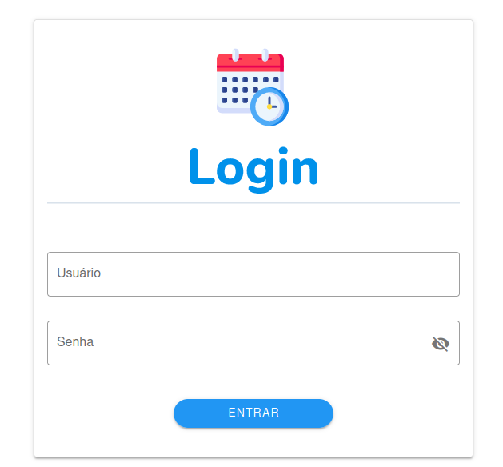
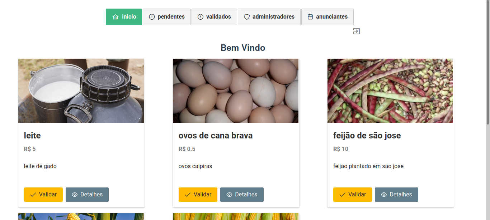

# Potiánuncios frontend

## ℹ️ Sobre o projeto
Este projeto deu inicio a criação de uma plataforma para facilitar o encontro e divulgação de produtos e serviços de produtores rurais de agricultura familiar do Rio Grande do Norte.

- Trabalho de conclusão do curso de Análise e Desenvolvimento de Sistemas, UFRN - EAJ. [Escola Agrícola de Jundiaí](https://eaj.ufrn.br/).
- O projeto conta com duas aplicações clientes se comunicando com a [API REST](https://github.com/brunojamelli/potianuncios-api), a [aplicação dos anunciantes](https://github.com/brunojamelli/poti-front/tree/master/poti-advertiser) têm o modo de utilização onde os anunciantes gerenciam os próprios anúncios e a [aplicação dos administradores](https://github.com/brunojamelli/poti-front/tree/master/poti-admin) tem a possibilidade da gerência e administração de todos os anúncios da plataforma, como é mostrado abaixo, e englobada na aplicação dos anunciantes estão as funcionalidades públicas, que são a visão que os clientes em potencial terão da plataforma.
---

## ⚙️ Funcionalidades Administradores

- [x] Autenticar-se
- [x] Visualizar todos os anúncios
- [x] Validar anúncios
- [x] Visualizar os administradores cadastrados
- [x] Cadastrar novos administradores

---
## ⚙️ Funcionalidades Anunciantes

- [x] Registrar-se na plataforma
- [x] Autenticar-se
- [x] Recuperar a senha via email
- [x] Visualizar os seus anúncios
- [x] Cadastrar novos anúncios
- [x] Adicionar fotos aos seus anúncios
- [x] Excluir anúncios
- [x] Ativar/desativar anúncios
- [x] Filtrar anúncios
---
## ⚙️ Funcionalidades De acesso sem Autenticação

- [x] Listagem de todos os anúncios
- [x] Detalhamento dos anúncios
- [x] Ter acesso às informações de contato do anunciante de cada anúncio

---

## 🎨 Demonstração Layout Administradores

  
Autenticação

  

      
    

  
Cadastro Novo Administrador

  

      
    

  
Tela de boas vindas administrador

  

      
    

  
Validação de anúncios

  

      
    

  
Listagem pendentes para validação

  

      
    

  
Detalhamento anuncio visão administrador

  

      
    

  
Listagem de administradores

  

      
    

---
## 🎨 Demonstração Layout Anunciantes
 - [Demo Potianuncios - Anunciantes parte 01](https://www.youtube.com/watch?v=8daWs-QVy8E)
  - [Demo Potianuncios - Anunciantes parte 02](https://www.youtube.com/watch?v=zJt6Rd9Z8cE)

---
## 🎨 Demonstração Layout Público
- [Demo Acesso Público](https://www.youtube.com/watch?v=ks7zoJE8uKw)
---

## 🛠 Tecnologias
### 💻 **Frontend** ([Vue.js](https://vuejs.org/))
- **[Axios](https://github.com/axios/axios)**
- **[Vuetify](https://vuetifyjs.com/en/)**
- **[Primevue](https://www.primefaces.org/primevue/showcase/#/)**
- **[Vue Router](https://router.vuejs.org/)**
- **[Vuex](https://vuex.vuejs.org/)**
- **[Vue Simple Alert](https://github.com/constkhi/vue-simple-alert)**

> Veja o arquivo [package.json](https://github.com/brunojamelli/poti-front/blob/master/poti-advertiser/package.json) do projeto vue dos anunciantes

> Veja o arquivo [package.json](https://github.com/brunojamelli/poti-front/blob/master/poti-admin/package.json) do projeto vue dos administradores
---
### 👩🏽‍💻 Autores
<table>
  <tr>
    <td align="center"><a href="https://github.com/brunojamelli"> <b>Bruno Jamelli</b></a> <a href="https://github.com/BiaChacon/spaces-scheduling" title="Code">💻 🎨</a></td>
  <tr>
</table>

---

## 📝 Licença
This project is under MIT. See at here [LICENSE](https://github.com/brunojamelli/poti-front/blob/master/LICENCE) for more informations.

---